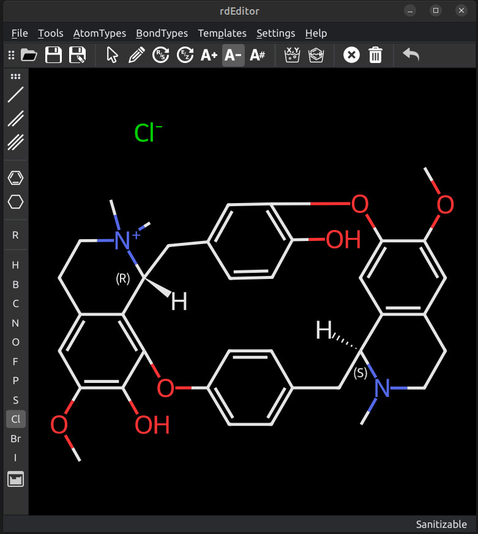

# rdeditor
Simple RDKit molecule editor GUI using PySide2


## Installation
* requirements

RDKIT and PySide

* installation
```bash
python setup.py install

```

The install script Will also install PySide2, but not RDkit, so that should be installed manually or via your operating systems package manager. A launch script will also be added so that it can be started from the command line via the rdEditor command.

## Alternative install
Install PySide and RDKit yourself, save the content of rdeditor folder to somewhere you like and start it with 
`python rdEditor.py`

## Usage

Can be started with `rdEditor` or `rdEditor your_molecule.mol` to start edit an existing molecule.
Interactions with the molecule are done via clicking on the canvas, atoms or bonds. A choice of tools is available.

#### Top Menu: 


From left to right
* Open: Open a molfile
* Save: Save current molecule
* Save As: Save current molecule with a new name


* Arrow: Select tool. Click on an atom to select it, click on the canvas to deselect. Clicking on multiple atoms one after another will select them, but only the lastly clicked one will be highlighted in red and used for operations, such as bond creation to another existing atom.
* Pen: Add tool. Clicking on an existing atom will add the current selected atom type to that atom with a single bond. Clicking on the canvas will add a disconnected atom. Clicking on a bond will cycle through single, double and triple bonds.
* Add bond / Join atoms: Will add a single bond between a clicked atom (or a previously selected atom) and the next atom clicked.
* Change Atom: Will substitute the atom clicked, with the currently selected atom type
* R/S: Change the stereo chemistry of the selected atom (see issues below)
* E/Z: Change E/Z stereo of double bonds (see issues below)
* Increase/Decrease charge: Will increase or decrease the charge of the atom clicked
* Delete atom/bond: 
* Clear Canvas
* Undo.

#### Side Bar:


Most commonly used bond types, and atom types can be selected. A Periodic table is accessible for exotic atom types.

#### Dropdown menus
Access to all standard operations as well as less used atom types and bond-types.

## Blog
I wrote a blog post with an overview of the structure of the code.
[https://www.wildcardconsulting.dk/rdeditor-an-open-source-molecular-editor-based-using-python-pyside2-and-rdkit/](https://www.wildcardconsulting.dk/rdeditor-an-open-source-molecular-editor-based-using-python-pyside2-and-rdkit/)


## ISSUES
* Not possible to set undefined R/S (no wiggly bond rendered)
* Not possible to distinguish undefined and trans when editing cis/trans double bonds
* Aromaticity perception hides double-single bonds (kekulization can do likewise)
* Molecule jumping now more limited, but atom placement may not be optimal as rest og structure kept fixed (and ignored?)
* Command line binding seem broken and not able to load molecule from commandline

